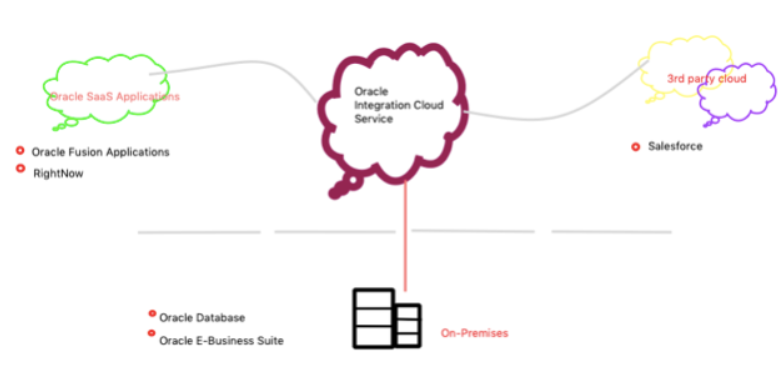

# OIC Basics

Oracle Integration Cloud Service is a complete, secure, but lightweight integration solution that enables you to connect your applications in the cloud. It simplifies connectivity between your applications and connects both your cloud application and on-premise application.

Oracle Integration Cloud Service provides native connectivity to Oracle Software as a Service (SaaS) applications, such as Oracle Sales Cloud, Oracle Right Now Cloud, and so on. 

After integrating the application and activating it to the runtime environment, the dashboard displays information about the running integrations, so you can monitor the status and processing statistics for each integration. The dashboard measures and tracks the performance of your transactions by capturing and reporting key information, such as throughput, the number of messages processed successfully, and the number of messages that failed processing.

Below are the definitions of different Components required to create an end-to-end integration in OIC:

### Integration : 
Integration uses connections to implement business process.  An integration includes at least a trigger or source connection  and invoke or target connection  and the field mapping between those two connections.
                 *Invoke (target connection ) : For requests sent from OIC Service to the  target
                *Trigger (source connection) : For requests sent to OIC Service
                
### Connections : 
A connection is based on an adapter. For example, to create a connection to a specific RightNow Cloud application instance, you must select the Oracle RightNow adapter and then specify the WSDL URL, security policy, and security credentials to connect to it

### Lookups : 
A bit like DVMs in SOA Suite, can cross-reference values of the same attribute/element when mapping from one system to another.

### Packages : 
You can group one or more integrations into a single structure called a package to easily import and export them to and from OIC Service. Packages being optional, integrations do not need to be a part of them. At least one integration is needed for a package to exist.
### Agents : 
The on-premises connectivity agent enables you to create integrations and exchange messages between on-premises applications and Oracle Integration Cloud Service. For example, sending requests from a cloud application to a on-premise database.
Adapters : Adapters are endpoints of any integration solution, so they interact directly with the business applications. Adapters do the actual connections with application resources and manage application transactions, security, exceptions, and so on. 